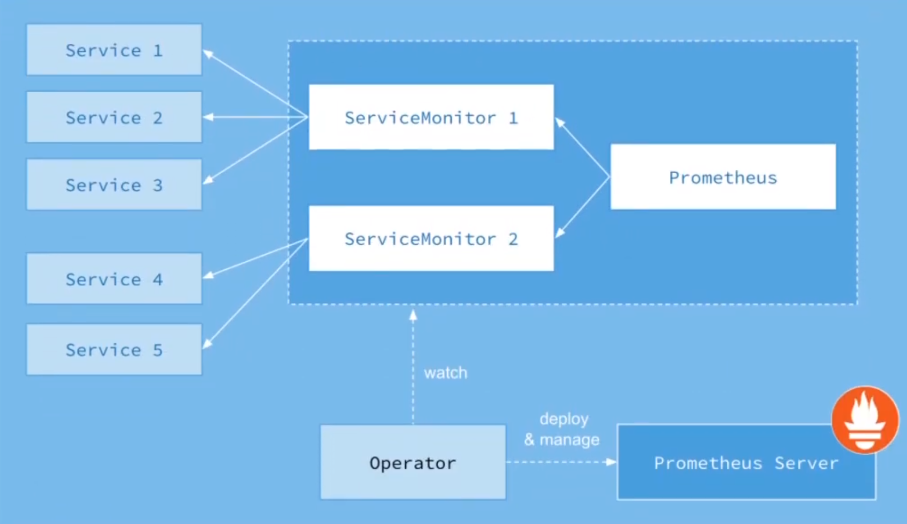

# 프로메테우스 헬름 설치 와 오퍼레이터

<br>

# 프로메테우스 with 헬름

<br>

## 헬름 차트 추가

```bash
helm repo add prometheus-community https://prometheus-community.github.io/helm-charts

helm repo update
```

<br>

## 헬름 차트 확인

```bash
helm show values prometheus-community/kube-prometheus-stack
```


<br>

## 헬름차트 설치

```bash
helm install -n [namespace] [RELEASE_NAME] prometheus-community/kube-prometheus-stack
```

<br>

## 헬름차트 values.yaml 추출

```
helm show values prometheus-community/kube-prometheus-stack > /tmp/override_values.yaml
```

## 헬름 설정

- pv, ingress 설정

<br>

### sample yaml

```yaml
prometheus:
  prometheusSpec:
    storageSpec:
      volumeClaimTemplate:
        spec:
          accessModes: ["ReadWriteOnce"]
          resources:
            requests:
              storage: 5Gi
            selector:
              matchLabels:
                app: ds-prometheus
```

### pv.yaml (Example)

```yaml
apiVersion: v1
kind: PersistentVolume
metadata:
  name: prometheus-pv
  labels:
    app: prometheus-test
spec:
  capacity:
    storage: 20Gi
  accessModes:
    - ReadWriteOnce
  hostPath:
    path: "/mnt/prometheus"
  volumeMode: Filesystem
```

<br>

### ingress_override_values.yaml

```yaml
prometheus:
  # change here
  prometheusSpec:
    routePrefix: /prom
    storageSpec:
      volumeClaimTemplate:
        spec:
          accessModes: ["ReadWriteOnce"]
          resources:
            requests:
              storage: 5Gi
          selector:
            matchLabels:
              app: prometheus-test
  ### ingress 쪽은 수정 필요!!
  #ingress:
    #enabled: true
    # change here
    #hosts:
      #- choilab.com
    # change here
    #paths:
      #- /prom
      
grafana:
  adminPassword: password1234
  ingress:
    enabled: true
    annotations:
      nginx.ingress.kubernetes.io/rewrite-target: /$2
    # change here
    path: /test(/|$)(.*)
    ### hosts 설정 수정 필요
    #hosts:
      #- choilab.com
  ### grafana.ini 설정 수정 필요 
  #grafana.ini:
    #server:
      # change here
      #domain: choilab.com
      #root_url: http://choilab/test/
      #serve_from_sub_path: true
```


## ingress 설정

<br>

### sample yaml

```yaml
prometheus:
  proemtheusSpec:
    routePrefix: /prom
  ingress:
    enabled: true
    hosts:
      - sample.com
    paths:
      - /prom
```

<br>

## 헬름 설치

```bash
# ns 가 없다면 생성 진행
kubectl create ns prometheus
```

<br>

```bash
# pv 생성 진행
# stack 자체에서 pv가 정의되어 있으므로 먼저 생성
kubectl apply -f pv.yaml
```

<br>


```bash
# recap for helm install
helm install -n [namespace] -f specific_file [RELEASE_NAME] prometheus-community/kube-prometheus-stack
```

<br>

```bash
# 헬름 설치 진행
helm install -n prometheus -f ingress_override_values.yaml preometheus-stack prometheus-community/kube-prometheus-stack
```

<br>

## 헬름 설치 확인

```bash
kubectl get pod -n prometheus
```

<br>

# Operator

<br>

## Operator Architecture




<br>

## 프로메테우스 오퍼레이터

<br>

### 역할

- 오퍼레이터가 변화를 감지하고 프로메테우스 서버에 반영
  - Operator 가 ServiceMonitor와 Promethues 영역을 감지(watch)
  - 감지된 사항을 Prometheus Server 에게 전달 및 적용 (deploy & manage)

<br>

- 쿠버네티스 리소스 익스포터를 쉽게 구현
  - Discovery of services, using the **PodMonitor** or **ServiceMonitor** (watch의 대상)


<br>

### 설정 정보:

- [kube-prometheus-stack 공식링크](https://github.com/prometheus-community/helm-charts/tree/main/charts/kube-prometheus-stack)
- Developing Prometheus Rules and Grafana Dashboards 참조
  - prometheus.io/scrape


<br>

### 용어 정리:

- 상단의 Operator Architecture 참조
  
<br>

- 서비스: **메트릭을 수집할 대상**
  - target (파드, label로 구분, **라벨 필수**)
- 


### Sample yaml file

- yaml 파일 정보는 아래의 링크에서 확인 가능
  - [prometheus-operator github](https://github.com/prometheus-operator/prometheus-operator/blob/main/Documentation/user-guides/getting-started.md#include-servicemonitors)
- RBAC의 경우, 위 링크에서 내용 참조
- 가이드에서는 노드포트 를 사용하여 validation 진행 (nodePort: 30900)

<br>

```yaml
# Deployment.yaml
apiVersion: apps/v1
kind: Deployment
metadata:
  name: example-app
spec:
  replicas: 3
  selector:
    matchLabels:
      app: example-app
  template:
    # metadata 항목을 통해, target pod 정의
    metadata:
      labels:
        app: example-app
    spec:
      containers:
      - name: example-app
        image: fabxc/instrumented_app
        ports:
        - name: web
          containerPort: 8080
```

<br>

```yaml
# Service.yaml
kind: Service
apiVersion: v1
metadata:
  name: example-app
  labels:
    app: example-app
spec:
  # selector 항목을 통해, target pod 정의
  selector:
    app: example-app
  ports:
  - name: web
    port: 8080
```

<br>

```yaml
# ServiceMonitor.yaml
apiVersion: monitoring.coreos.com/v1
kind: ServiceMonitor
metadata:
  name: example-app
  # labels 항목을 통해, Prometheus.yaml 에서 정의한 matchLabels 항목의 label 명과 매치
  labels:
    team: frontend
spec:
  # selector의 matchLabels 항목을 통해, target pod 정의
  selector:
    matchLabels:
      app: example-app
  endpoints:
  - port: web
```

<br>

```yaml
# Prometheus.yaml
apiVersion: monitoring.coreos.com/v1
kind: Prometheus
metadata:
  name: prometheus
spec:
  serviceAccountName: prometheus
  # serviceMonitorSelector의 matchLabels 항목을 통해, ServiceMonitor labels 정의
  serviceMonitorSelector:
    matchLabels:
      team: frontend
  resources:
    requests:
      memory: 400Mi
  enableAdminAPI: false
```


<br>