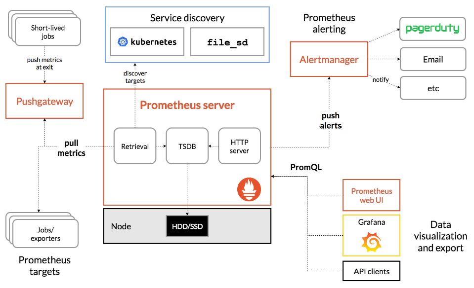

# Prometheus 소개

## Metric 수집 방식
- push 방식
  - 어플리케이션 내부에서 API 로직 필요
  - or 어플리케이션 마다 에이전트가 필요
  - Coupling metric backend system
  - Require (agent | logic) per application
- pull 방식
  - Monitoring 시스템 자체가 주체가됨
  - 타겟을 명시 (서비스 디스커버리 필요)
  - 모니터링 시스템 내에서 설정
  - Require service discovery
  - **Easy to update setting**

 

## Prometheus

- Open source system monitoring & alerting toolkit (Build at SoundCloud)
- CNCF project in 2016 after k8s
- Collect & Store time series data (metric)

 

### Features

- Multi-dimensional data model
- PromQL
- No reliance on distributed storage
- Via **pull method** over HTTP
- Pushing time series is support (gateway)
- Targets r discovered via service discovery or static conf

 

### Architecure

- Prometheus server: TSDB 소유, 서버안에 데이터 저장
- Prometheus targets
- Service discovery
- Pushgateway: pull 방식을 지원해주는 리소스 (**Fargate** 에 좋을 것으로 보임)
- Alertmanager: Alert 담당
- Data visualization and export

### Metric types:

- Counter: Cumulative metirc (reset 0)
- Gauge: Single numerical value (up & down)
- Histogram: Samples observations (사전에 bucket 등을 지정, Server side에서 부하 발생)
- Summary: Samples observations (quantile 지원, 분위수, Client side에서 부하 발생)